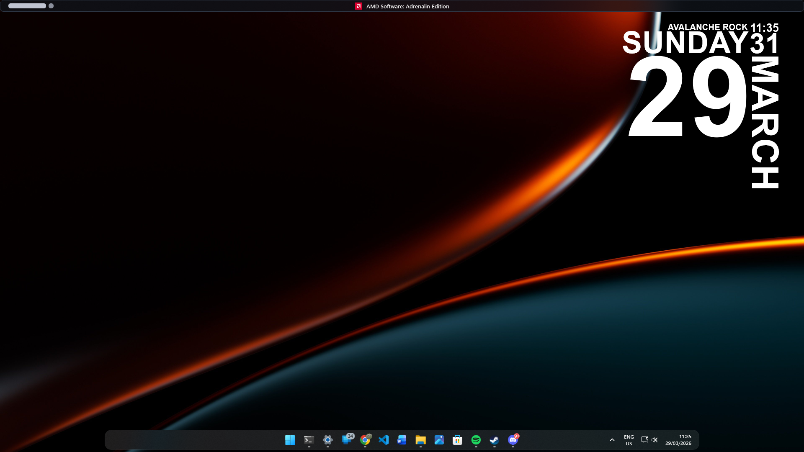
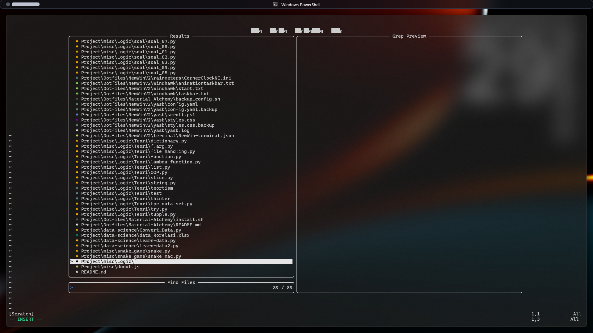

# NewWin V2
# New Minimalism — Windows 11 Rice

Minimal Windows 11 setup powered by:

- Komorebi (tiling window manager)
- YASB (status bar)
- Windhawk (UI customization)

---

## Features

- Clean tiling layout
- Minimal top bar
- Nerd Font support

## Components

WM: Komorebi  
Bar: YASB  
Customization: Windhawk  
Terminal: Windows Terminal  
Font: JetBrainsMono Nerd Font  

## Photos

---

## Video

.mp4)

---

Minimal. Functional. Intentional.
